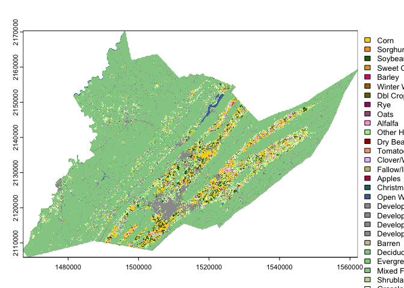
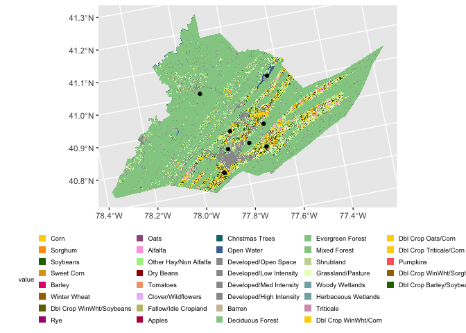
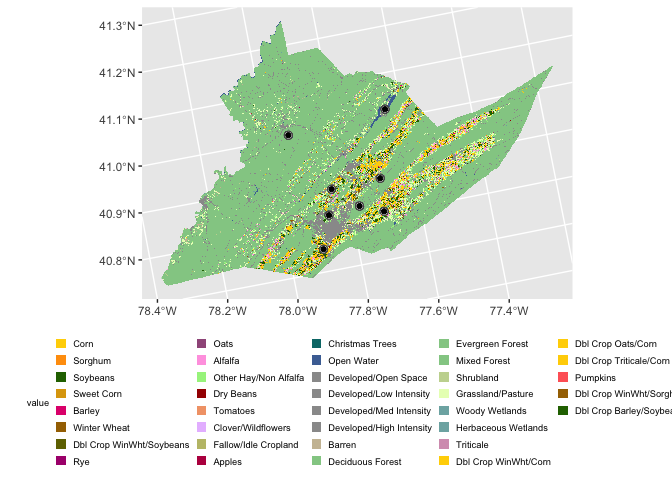

<!-- README.md is generated from README.Rmd. Please edit that file -->

# EcoSpatial Summit Workshop

This workshop is designed to introduce users to the new [**beeshiny
app**](https://beesuite.psu.edu/beeshiny/).

beeshiny can be used to query data commonly used when modeling the
environemental drivers of species’ or commmunity responses. beeshiny was
originally build as a companion to
[Beescape](https://beescape.psu.edu/).

beeshiny allows users to extract:

- climate data: monthly precipitation, min, and max temperature from
  PRISM
- crop land covers: from the NASS CropLand Data Layer
- beescape indices: spring forage, summer forage, fall forage, nesting,
  and pesticides

## Nomenclature

- **raster:** A form of geographic data that represents the landscape as
  a grid of cells. Grid values can be continuous values, signifying
  things like elevation, temperature, or spectral information
  (e.g. color) in a satellite image; or categorical values, signifying
  thematic classes like land cover.
- **vector:** Another form of geographic data that represents specific
  features on the landscape composed of discrete geometric locations
  that consist of x and y values. These can be points, lines, or
  polygons.
- **Cropland Data Layer (CDL):** A set of raster datasets produced by
  the USDA Nationa Agricultural Statistics (NASS) Service and
  Agricultural Research Service (ARS) that represents annual
  crop-specific land cover produced from satellite imagery and ground
  reference data.

## Data Details

We will use data downloaded from the [**beeshiny
app**](https://beesuite.psu.edu/beeshiny/), along with point data
representing hypothetical sites in Centre County, PA, which can be
downloaded from this repository in the \`/data\`\` folder.

- *Note that if you are unable to access the data on beeshiny, backup
  data are available in the repository in* `data/backups`

## Load packages

There are a number of packages in R that are helpful in working with
spatial data. For this workshop we will be using
[sf](https://r-spatial.github.io/sf/) and
[terra](https://rspatial.org/index.html). For data wrangling and
visualizations we will use `dplyr`, `ggplot2` and `tidyterra`.

| Name | Description | Link |
|:---|:---|:---|
| `dplyr` | Package that provides a ‘grammar’ of data manipulation in `R` | <https://dplyr.tidyverse.org/> |
| `ggplot2` | Package that provides a system for declaratively creating graphics | <https://ggplot2.tidyverse.org/> |
| `sf` | Package for manipulating 2-D geographic vector data | <https://r-spatial.github.io/sf/> |
| `terra` | Package for spatial data analysis | <https://rspatial.github.io/terra/> |
| `tidyterra` | Package for integrating objects from `terra` with the `dplyr` and `ggplot2` packages | <https://dieghernan.github.io/tidyterra/> |

Because some spatial functions have the same names as dplyr functions it
is helpful to load the spatial packages last. We can also use the `::`
to specify the package for function calls.

Unhash and use install.packages for any packages your may not already
have installed

``` r
library(dplyr)
library(ggplot2)
#install.packages("sf", dependencies = TRUE)
#install.packages("terra", dependencies = TRUE)
#install.packages("tidyterra", dependencies = TRUE)
library(sf)
library(terra)
library(tidyterra)
```

# Working with raster data in R

## Get raster data from beeshiny

Use [**beeshiny**](https://beesuite.psu.edu/beeshiny/) to download a CDL
raster for any county in the US you would like for any year you want

## Read in raster data

Downloaded data from beeshiny is packaged as a zipped file called
data.zip. Inside this file you should have a .tif file. The name
indicates the data type, in this case CDL, the year and the FIPS code
that corresponds to the county you selected.

Move the .tif file into the /data folder in your ecospatial-workshop
directory

The first thing we will do is use the `rast()` function to read the .tif
file into R as a SpatRaster. NOTE: your CDL file may have a different
year and a different number after the FIPS code.

``` r
county_cdl <- rast("data/CDL_2021_FIPS_42027.tif") # <- replace the .tif file with your file name

county_cdl
#> class       : SpatRaster 
#> dimensions  : 2147, 3167, 1  (nrow, ncol, nlyr)
#> resolution  : 30, 30  (x, y)
#> extent      : 1467225, 1562235, 2105925, 2170335  (xmin, xmax, ymin, ymax)
#> coord. ref. : NAD83 / Conus Albers (EPSG:5070) 
#> source      : CDL_2021_FIPS_42027.tif 
#> name        : Class_Names 
#> min value   :           1 
#> max value   :         254
```

An important attribute of spatial data are their Coordinate Reference
System or CRS. This information tells us what model of the earth (ex
WGS84 or NAD83) is being referenced as well as the units of the
coordinates such as decimal degrees.

Rasters downloaded from beeshiny inherit their CRS from the raster they
were originally extracted from.

Let’s view the CRS for your county cdl:

``` r
crs(county_cdl)
#> [1] "PROJCRS[\"NAD83 / Conus Albers\",\n    BASEGEOGCRS[\"NAD83\",\n        DATUM[\"North American Datum 1983\",\n            ELLIPSOID[\"GRS 1980\",6378137,298.257222101,\n                LENGTHUNIT[\"metre\",1]]],\n        PRIMEM[\"Greenwich\",0,\n            ANGLEUNIT[\"degree\",0.0174532925199433]],\n        ID[\"EPSG\",4269]],\n    CONVERSION[\"Conus Albers\",\n        METHOD[\"Albers Equal Area\",\n            ID[\"EPSG\",9822]],\n        PARAMETER[\"Latitude of false origin\",23,\n            ANGLEUNIT[\"degree\",0.0174532925199433],\n            ID[\"EPSG\",8821]],\n        PARAMETER[\"Longitude of false origin\",-96,\n            ANGLEUNIT[\"degree\",0.0174532925199433],\n            ID[\"EPSG\",8822]],\n        PARAMETER[\"Latitude of 1st standard parallel\",29.5,\n            ANGLEUNIT[\"degree\",0.0174532925199433],\n            ID[\"EPSG\",8823]],\n        PARAMETER[\"Latitude of 2nd standard parallel\",45.5,\n            ANGLEUNIT[\"degree\",0.0174532925199433],\n            ID[\"EPSG\",8824]],\n        PARAMETER[\"Easting at false origin\",0,\n            LENGTHUNIT[\"metre\",1],\n            ID[\"EPSG\",8826]],\n        PARAMETER[\"Northing at false origin\",0,\n            LENGTHUNIT[\"metre\",1],\n            ID[\"EPSG\",8827]]],\n    CS[Cartesian,2],\n        AXIS[\"easting (X)\",east,\n            ORDER[1],\n            LENGTHUNIT[\"metre\",1]],\n        AXIS[\"northing (Y)\",north,\n            ORDER[2],\n            LENGTHUNIT[\"metre\",1]],\n    USAGE[\n        SCOPE[\"Data analysis and small scale data presentation for contiguous lower 48 states.\"],\n        AREA[\"United States (USA) - CONUS onshore - Alabama; Arizona; Arkansas; California; Colorado; Connecticut; Delaware; Florida; Georgia; Idaho; Illinois; Indiana; Iowa; Kansas; Kentucky; Louisiana; Maine; Maryland; Massachusetts; Michigan; Minnesota; Mississippi; Missouri; Montana; Nebraska; Nevada; New Hampshire; New Jersey; New Mexico; New York; North Carolina; North Dakota; Ohio; Oklahoma; Oregon; Pennsylvania; Rhode Island; South Carolina; South Dakota; Tennessee; Texas; Utah; Vermont; Virginia; Washington; West Virginia; Wisconsin; Wyoming.\"],\n        BBOX[24.41,-124.79,49.38,-66.91]],\n    ID[\"EPSG\",5070]]"
```

We can see that our CDL raster is using the North American Datum of 1983
as it’s model for the shape of the earth. Our two-dimensional projection
model of earth’s 3d surface is Alber’s Equal Area and the units of our
coordinates are in meters.

## Visualize raster data

We can visualize our county CDl raster using either base R plotting and
terra

``` r
plot(county_cdl)
```

<!-- -->

or using ggplot2 and tidyterra

``` r
ggplot() +
  geom_spatraster(data = county_cdl, aes(fill = Class_Names)) 
```

<!-- -->

## Reclass raster values

We can reclassify the CDL raster giving it the proper land cover names
and turning it into a map of floral resources using the values from [Koh
et al. 2015](https://www.pnas.org/doi/abs/10.1073/pnas.1517685113).

The table contains each CDL value, it’s corresponding class name and the
values for several indices.

``` r
reclass_table <- read.csv("data/cdl_reclass_koh.csv")
head(reclass_table)
#>   Class_Names CLASS_NAME nesting_ground_availability_index
#> 1           0 Background                         0.0000000
#> 2           1       Corn                         0.1451854
#> 3           2     Cotton                         0.3355898
#> 4           3       Rice                         0.1513067
#> 5           4    Sorghum                         0.1451854
#> 6           5   Soybeans                         0.1993286
#>   nesting_cavity_availability_index nesting_stem_availability_index
#> 1                        0.00000000                       0.0000000
#> 2                        0.08947642                       0.1069437
#> 3                        0.22867787                       0.2335293
#> 4                        0.13945144                       0.1089976
#> 5                        0.08947642                       0.1069437
#> 6                        0.11568643                       0.1263174
#>   nesting_wood_availability_index floral_resources_spring_index
#> 1                       0.0000000                    0.00000000
#> 2                       0.1026114                    0.09025383
#> 3                       0.2774442                    0.39644857
#> 4                       0.1024528                    0.11008896
#> 5                       0.1026114                    0.09025383
#> 6                       0.1470606                    0.24359554
#>   floral_resources_summer_index floral_resources_fall_index
#> 1                     0.0000000                   0.0000000
#> 2                     0.2747074                   0.1323095
#> 3                     0.3160415                   0.1655815
#> 4                     0.2821817                   0.1334781
#> 5                     0.2747074                   0.1323095
#> 6                     0.3971508                   0.1858675
```

We can see from our plots that the CDL Class Names are stored as numeric
values, these have no numeric meaning. They simply correspond to a land
cover class.

The values can be reclassified into their class names or into other
values using the `classify()` function.

### Reclass to named CDL classes

We can also reclassify the CDL to show it’s land class names rather than
the values. In this case we will use a different work flow by modifying
the levels.

First we set the levels of the raster to the land cover class names
using the first two columns of our reclass table

``` r
levels(county_cdl) <- as.data.frame(reclass_table[,1:2])
```

Then we can even recolor the classes to match the traditional NASS CDL
style.

First, we will load in a file with which describes the color values
associated with each CDL value.

``` r
cdl_colormap <- read.csv("data/cdl_colormap.csv")
cdl_colormap
#>     Class red green blue alpha
#> 1       0   0     0    0   255
#> 2       1 255   211    0   255
#> 3       2 255    38   38   255
#> 4       3   0   168  228   255
#> 5       4 255   158   11   255
#> 6       5  38   112    0   255
#> 7       6 255   255    0   255
#> 8       7   0     0    0   255
#> 9       8   0     0    0   255
#> 10      9   0     0    0   255
#> 11     10 112   165    0   255
#> 12     11   0   175   75   255
#> 13     12 221   165   11   255
#> 14     13 221   165   11   255
#> 15     14 126   211  255   255
#> 16     15   0     0    0   255
#> 17     16   0     0    0   255
#> 18     17   0     0    0   255
#> 19     18   0     0    0   255
#> 20     19   0     0    0   255
#> 21     20   0     0    0   255
#> 22     21 226     0  124   255
#> 23     22 137    98   84   255
#> 24     23 216   181  107   255
#> 25     24 165   112    0   255
#> 26     25 214   158  188   255
#> 27     26 112   112    0   255
#> 28     27 172     0  124   255
#> 29     28 160    89  137   255
#> 30     29 112     0   73   255
#> 31     30 214   158  188   255
#> 32     31 209   255    0   255
#> 33     32 126   153  255   255
#> 34     33 214   214    0   255
#> 35     34 209   255    0   255
#> 36     35   0   175   75   255
#> 37     36 255   165  226   255
#> 38     37 165   242  140   255
#> 39     38   0   175   75   255
#> 40     39 214   158  188   255
#> 41     40   0     0    0   255
#> 42     41 168     0  228   255
#> 43     42 165     0    0   255
#> 44     43 112    38    0   255
#> 45     44   0   175   75   255
#> 46     45 177   126  255   255
#> 47     46 112    38    0   255
#> 48     47 255   102  102   255
#> 49     48 255   102  102   255
#> 50     49 255   204  102   255
#> 51     50 255   102  102   255
#> 52     51   0   175   75   255
#> 53     52   0   221  175   255
#> 54     53  84   255    0   255
#> 55     54 242   163  119   255
#> 56     55 255   102  102   255
#> 57     56   0   175   75   255
#> 58     57 126   211  255   255
#> 59     58 232   191  255   255
#> 60     59 175   255  221   255
#> 61     60   0   175   75   255
#> 62     61 191   191  119   255
#> 63     62   0     0    0   255
#> 64     63 147   204  147   255
#> 65     64 198   214  158   255
#> 66     65 204   191  163   255
#> 67     66 255     0  255   255
#> 68     67 255   142  170   255
#> 69     68 186     0   79   255
#> 70     69 112    68  137   255
#> 71     70   0   119  119   255
#> 72     71 177   154  112   255
#> 73     72 255   255  126   255
#> 74     73   0     0    0   255
#> 75     74 181   112   91   255
#> 76     75   0   165  130   255
#> 77     76 233   214  175   255
#> 78     77 177   154  112   255
#> 79     78   0     0    0   255
#> 80     79   0     0    0   255
#> 81     80   0     0    0   255
#> 82     81 242   242  242   255
#> 83     82 154   154  154   255
#> 84     83  75   112  163   255
#> 85     84   0     0    0   255
#> 86     85   0     0    0   255
#> 87     86   0     0    0   255
#> 88     87 126   177  177   255
#> 89     88 232   255  191   255
#> 90     89   0     0    0   255
#> 91     90   0     0    0   255
#> 92     91   0     0    0   255
#> 93     92   0   255  255   255
#> 94     93   0     0    0   255
#> 95     94   0     0    0   255
#> 96     95   0     0    0   255
#> 97     96   0     0    0   255
#> 98     97   0     0    0   255
#> 99     98   0     0    0   255
#> 100    99   0     0    0   255
#> 101   100   0     0    0   255
#> 102   101   0     0    0   255
#> 103   102   0     0    0   255
#> 104   103   0     0    0   255
#> 105   104   0     0    0   255
#> 106   105   0     0    0   255
#> 107   106   0     0    0   255
#> 108   107   0     0    0   255
#> 109   108   0     0    0   255
#> 110   109   0     0    0   255
#> 111   110   0     0    0   255
#> 112   111  75   112  163   255
#> 113   112 211   226  249   255
#> 114   113   0     0    0   255
#> 115   114   0     0    0   255
#> 116   115   0     0    0   255
#> 117   116   0     0    0   255
#> 118   117   0     0    0   255
#> 119   118   0     0    0   255
#> 120   119   0     0    0   255
#> 121   120   0     0    0   255
#> 122   121 154   154  154   255
#> 123   122 154   154  154   255
#> 124   123 154   154  154   255
#> 125   124 154   154  154   255
#> 126   125   0     0    0   255
#> 127   126   0     0    0   255
#> 128   127   0     0    0   255
#> 129   128   0     0    0   255
#> 130   129   0     0    0   255
#> 131   130   0     0    0   255
#> 132   131 204   191  163   255
#> 133   132   0     0    0   255
#> 134   133   0     0    0   255
#> 135   134   0     0    0   255
#> 136   135   0     0    0   255
#> 137   136   0     0    0   255
#> 138   137   0     0    0   255
#> 139   138   0     0    0   255
#> 140   139   0     0    0   255
#> 141   140   0     0    0   255
#> 142   141 147   204  147   255
#> 143   142 147   204  147   255
#> 144   143 147   204  147   255
#> 145   144   0     0    0   255
#> 146   145   0     0    0   255
#> 147   146   0     0    0   255
#> 148   147   0     0    0   255
#> 149   148   0     0    0   255
#> 150   149   0     0    0   255
#> 151   150   0     0    0   255
#> 152   151   0     0    0   255
#> 153   152 198   214  158   255
#> 154   153   0     0    0   255
#> 155   154   0     0    0   255
#> 156   155   0     0    0   255
#> 157   156   0     0    0   255
#> 158   157   0     0    0   255
#> 159   158   0     0    0   255
#> 160   159   0     0    0   255
#> 161   160   0     0    0   255
#> 162   161   0     0    0   255
#> 163   162   0     0    0   255
#> 164   163   0     0    0   255
#> 165   164   0     0    0   255
#> 166   165   0     0    0   255
#> 167   166   0     0    0   255
#> 168   167   0     0    0   255
#> 169   168   0     0    0   255
#> 170   169   0     0    0   255
#> 171   170   0     0    0   255
#> 172   171   0     0    0   255
#> 173   172   0     0    0   255
#> 174   173   0     0    0   255
#> 175   174   0     0    0   255
#> 176   175   0     0    0   255
#> 177   176 232   255  191   255
#> 178   177   0     0    0   255
#> 179   178   0     0    0   255
#> 180   179   0     0    0   255
#> 181   180   0     0    0   255
#> 182   181   0     0    0   255
#> 183   182   0     0    0   255
#> 184   183   0     0    0   255
#> 185   184   0     0    0   255
#> 186   185   0     0    0   255
#> 187   186   0     0    0   255
#> 188   187   0     0    0   255
#> 189   188   0     0    0   255
#> 190   189   0     0    0   255
#> 191   190 126   177  177   255
#> 192   191   0     0    0   255
#> 193   192   0     0    0   255
#> 194   193   0     0    0   255
#> 195   194   0     0    0   255
#> 196   195 126   177  177   255
#> 197   196   0     0    0   255
#> 198   197   0     0    0   255
#> 199   198   0     0    0   255
#> 200   199   0     0    0   255
#> 201   200   0     0    0   255
#> 202   201   0     0    0   255
#> 203   202   0     0    0   255
#> 204   203   0     0    0   255
#> 205   204   0   255  140   255
#> 206   205 214   158  188   255
#> 207   206 255   102  102   255
#> 208   207 255   102  102   255
#> 209   208 255   102  102   255
#> 210   209 255   102  102   255
#> 211   210 255   142  170   255
#> 212   211  51    73   51   255
#> 213   212 228   112   38   255
#> 214   213 255   102  102   255
#> 215   214 255   102  102   255
#> 216   215 102   153   76   255
#> 217   216 255   102  102   255
#> 218   217 177   154  112   255
#> 219   218 255   142  170   255
#> 220   219 255   102  102   255
#> 221   220 255   142  170   255
#> 222   221 255   102  102   255
#> 223   222 255   102  102   255
#> 224   223 255   142  170   255
#> 225   224   0   175   75   255
#> 226   225 255   211    0   255
#> 227   226 255   211    0   255
#> 228   227 255   102  102   255
#> 229   228 255   210    0   255
#> 230   229 255   102  102   255
#> 231   230 137    98   84   255
#> 232   231 255   102  102   255
#> 233   232 255    38   38   255
#> 234   233 226     0  124   255
#> 235   234 255   158   11   255
#> 236   235 255   158   11   255
#> 237   236 165   112    0   255
#> 238   237 255   211    0   255
#> 239   238 165   112    0   255
#> 240   239  38   112    0   255
#> 241   240  38   112    0   255
#> 242   241 255   211    0   255
#> 243   242   0     0  153   255
#> 244   243 255   102  102   255
#> 245   244 255   102  102   255
#> 246   245 255   102  102   255
#> 247   246 255   102  102   255
#> 248   247 255   102  102   255
#> 249   248 255   102  102   255
#> 250   249 255   102  102   255
#> 251   250 255   102  102   255
#> 252   251   0     0    0   255
#> 253   252   0     0    0   255
#> 254   253   0     0    0   255
#> 255   254  38   112    0   255
#> 256   255   0     0    0   255
```

Then we can assign the color values to their corresponding levels in the
raster and view a plot to check it out.

``` r
terra::coltab(county_cdl) <- cdl_colormap

ggplot() +
  geom_spatraster(data = county_cdl, aes(fill = CLASS_NAME))
```

<!-- -->

The legend is now quite large but can be easily modified using ggplot2
themes functions

``` r
ggplot() +
  geom_spatraster(data = county_cdl, aes(fill = CLASS_NAME)) +
  theme(legend.title = element_text(size = 7), 
        legend.text = element_text(size = 7), 
        legend.key.size = unit(0.25, 'cm'),
        legend.position="bottom") 
```

<!-- -->

### Reclass to spring floral resources map

We will select just the columns corresponding to the CDL value and the
spring floral resources to reclassify our county CDL and generate a map
of spring floral resources across the county

``` r
county_floral_sp <- classify(county_cdl,
                    reclass_table[,c("Class_Names",
                                     "floral_resources_spring_index")])

plot(county_floral_sp)
```

<!-- -->

## Inspect raster values

Using the `values()` function we can inspect the distribution of spring
floral values for your county. We will set the `na.rm=TRUE` argument so
that all the cells outside of the county are not included

``` r
summary(values(county_floral_sp, na.rm=TRUE))
#>    CLASS_NAME    
#>  Min.   :0.0000  
#>  1st Qu.:0.4558  
#>  Median :0.6965  
#>  Mean   :0.5813  
#>  3rd Qu.:0.6965  
#>  Max.   :0.6993
hist(values(county_floral_sp, na.rm=TRUE))
```

<!-- -->

and look at at individual grid cell values. In this case we, will only
extract the first 20 grid cell values.

``` r
values(county_floral_sp, na.rm=TRUE)[1:20]
#>  [1] 0.5848480 0.0000000 0.6965277 0.5848480 0.0000000 0.0000000 0.6965277
#>  [8] 0.5848480 0.0000000 0.0000000 0.6965277 0.6965277 0.6965277 0.0000000
#> [15] 0.0000000 0.0000000 0.6965277 0.6965277 0.5848480 0.0000000
```

## Check your learning

1.  Use beeshiny to download the CDL raster for Centre County Pa for any
    year you want

2.  Move the CDL raster for Centre County to the /data folder in your
    ecospatial-workshop directory

3.  Read the raster into R as a terra SpatRaster

4.  Replace the CDL value codes with the land cover class names

``` r
centre_cdl <- rast("data/CDL_2021_FIPS_42027.tif") 

#OR if beeshiny not working:

centre_cdl <- rast("data/backups/pa_centre_cdl_2021.tif") 
levels(centre_cdl) <- as.data.frame(reclass_table[,1:2])
terra::coltab(centre_cdl) <- as.data.frame(cdl_colormap)
#plot(centre_cdl)
```

# Working with point data

## Read in point data

``` r
centre_sites <- read.csv("data/centre_co_pts.csv")
centre_sites <- st_as_sf(centre_sites, coords=c("Long","Lat"), 
                         crs = 4326) #set the crs
centre_sites
#> Simple feature collection with 8 features and 1 field
#> Geometry type: POINT
#> Dimension:     XY
#> Bounding box:  xmin: -77.93778 ymin: 40.74921 xmax: -77.64715 ymax: 41.02197
#> Geodetic CRS:  WGS 84
#>   SiteID                   geometry
#> 1  Site1 POINT (-77.70654 40.80497)
#> 2  Site2 POINT (-77.89991 40.74921)
#> 3  Site3 POINT (-77.93778 41.00641)
#> 4  Site4  POINT (-77.8659 40.81954)
#> 5  Site5 POINT (-77.64715 41.02197)
#> 6  Site6 POINT (-77.84409 40.87366)
#> 7  Site7 POINT (-77.77373 40.82634)
#> 8  Site8 POINT (-77.69934 40.87697)
```

## Visualize point data

``` r
ggplot()+
  geom_spatraster(data = centre_cdl, aes(fill = CLASS_NAME)) +
  geom_sf(data=centre_sites) + 
  theme(legend.title = element_text(size = 7), 
        legend.text = element_text(size = 7), 
        legend.key.size = unit(0.25, 'cm'),
        legend.position="bottom") 
```

<!-- -->

## Buffer around points

``` r
centre_sites_1000m <- st_buffer(centre_sites, 1000)
```

``` r
ggplot()+
  geom_spatraster(data = centre_cdl, aes(fill = CLASS_NAME)) +
  geom_sf(data = centre_sites_1000m)+
  geom_sf(data=centre_sites) + 
  theme(legend.title = element_text(size = 7), 
        legend.text = element_text(size = 7), 
        legend.key.size = unit(0.25, 'cm'),
        legend.position="bottom") 
```

<!-- -->

## Extract CDL values within buffers

``` r
centre_table_1000m <- extract(centre_cdl, centre_sites_1000m, fun="table", ID=F)
centre_table_1000m
#>   Background Corn Cotton Rice Sorghum Soybeans Sunflower Peanuts Tobacco
#> 1          0 1240      0    0      12     1021         0       0       0
#> 2          0 1168      0    0       0      968         0       0       0
#> 3          0    0      0    0       0        0         0       0       0
#> 4          0   64      0    0       0       80         0       0       0
#> 5          0   18      0    0       1        5         0       0       0
#> 6          0  882      0    0       1      836         0       0       0
#> 7          0    0      0    0       0        0         0       0       0
#> 8          0   92      0    0       0        0         0       0       0
#>   Sweet Corn Pop or Orn Corn Mint Barley Durum Wheat Spring Wheat Winter Wheat
#> 1          0               0    0      0           0            0          225
#> 2          0               0    0      7           0            0          445
#> 3          0               0    0      0           0            0            0
#> 4          0               0    0      1           0            0            7
#> 5          0               0    0      0           0            0            1
#> 6          0               0    0      1           0            0           24
#> 7          0               0    0      0           0            0            0
#> 8          0               0    0      0           0            0            0
#>   Other Small Grains Dbl Crop WinWht/Soybeans Rye Oats Millet Speltz Canola
#> 1                  0                        0   2   20      0      0      0
#> 2                  0                        0   7  136      0      0      0
#> 3                  0                        0   0    0      0      0      0
#> 4                  0                        0   0    0      0      0      0
#> 5                  0                        0   0    0      0      0      0
#> 6                  0                        0   0    0      0      0      0
#> 7                  0                        0   0    0      0      0      0
#> 8                  0                        0   0    0      0      0      0
#>   Flaxseed Safflower Rape Seed Mustard Alfalfa Other Hay/Non Alfalfa Camelina
#> 1        0         0         0       0     156                    88        0
#> 2        0         0         0       0     100                    29        0
#> 3        0         0         0       0       0                     0        0
#> 4        0         0         0       0      82                   410        0
#> 5        0         0         0       0       2                    50        0
#> 6        0         0         0       0     124                   407        0
#> 7        0         0         0       0       0                     0        0
#> 8        0         0         0       0       4                    25        0
#>   Buckwheat Sugarbeets Dry Beans Potatoes Other Crops Sugarcane Sweet Potatoes
#> 1         0          0        43        0           0         0              0
#> 2         0          0       118        0           0         0              0
#> 3         0          0         0        0           0         0              0
#> 4         0          0         0        0           0         0              0
#> 5         0          0         1        0           0         0              0
#> 6         0          0         0        0           0         0              0
#> 7         0          0         0        0           0         0              0
#> 8         0          0         0        0           0         0              0
#>   Misc Vegs & Fruits Watermelons Onions Cucumbers Chick Peas Lentils Peas
#> 1                  0           0      0         0          0       0    0
#> 2                  0           0      0         0          0       0    0
#> 3                  0           0      0         0          0       0    0
#> 4                  0           0      0         0          0       0    0
#> 5                  0           0      0         0          0       0    0
#> 6                  0           0      0         0          0       0    0
#> 7                  0           0      0         0          0       0    0
#> 8                  0           0      0         0          0       0    0
#>   Tomatoes Caneberries Hops Herbs Clover/Wildflowers Sod/Grass Seed Switchgrass
#> 1        0           0    0     0                  0              0           0
#> 2        0           0    0     0                  0              0           0
#> 3        0           0    0     0                  0              0           0
#> 4        1           0    0     0                  0              0           0
#> 5        1           0    0     0                  0              0           0
#> 6        0           0    0     0                  0              0           0
#> 7        0           0    0     0                  0              0           0
#> 8        0           0    0     0                  0              0           0
#>   Fallow/Idle Cropland Forest Shrubland Barren Cherries Peaches Apples Grapes
#> 1                    0      0         0      4        0       0      0      0
#> 2                    0      0         0      0        0       0      0      0
#> 3                    0      0         0      0        0       0      0      0
#> 4                    0      0         1      1        0       0      1      0
#> 5                    0      0         1      7        0       0      0      0
#> 6                    0      0         1      1        0       0      1      0
#> 7                    0      0         5      0        0       0      0      0
#> 8                    0      0         1      7        0       0      0      0
#>   Christmas Trees Other Tree Crops Citrus Pecans Almonds Walnuts Pears
#> 1               0                0      0      0       0       0     0
#> 2               0                0      0      0       0       0     0
#> 3               0                0      0      0       0       0     0
#> 4               0                0      0      0       0       0     0
#> 5               0                0      0      0       0       0     0
#> 6               0                0      0      0       0       0     0
#> 7               0                0      0      0       0       0     0
#> 8               0                0      0      0       0       0     0
#>   Clouds/No Data Developed Water Wetlands Nonag/Undefined Aquaculture
#> 1              0         0     0        0               0           0
#> 2              0         0     0        0               0           0
#> 3              0         0     0        0               0           0
#> 4              0         0     0        0               0           0
#> 5              0         0     0        0               0           0
#> 6              0         0     0        0               0           0
#> 7              0         0     0        0               0           0
#> 8              0         0     0        0               0           0
#>   Open Water Perennial Ice/Snow Developed/Open Space Developed/Low Intensity
#> 1          0                  0                  224                      69
#> 2          0                  0                   52                      95
#> 3          0                  0                  208                       9
#> 4          0                  0                  298                     367
#> 5       1621                  0                  172                      95
#> 6          0                  0                  299                     214
#> 7          0                  0                  135                       1
#> 8          0                  0                  162                       8
#>   Developed/Med Intensity Developed/High Intensity Deciduous Forest
#> 1                      22                        2              178
#> 2                      45                        8              116
#> 3                       2                        0             3264
#> 4                     401                      137              474
#> 5                      33                        0              391
#> 6                      22                        4              236
#> 7                       0                        0             3358
#> 8                       1                        0             2217
#>   Evergreen Forest Mixed Forest Grassland/Pasture Woody Wetlands
#> 1               10           22               213              0
#> 2                1           12               241              0
#> 3                1           56                 9              0
#> 4              106          303               806              0
#> 5               35          692               415              5
#> 6                6           56               437              0
#> 7                9           37                 4              0
#> 8              533          458                36              5
#>   Herbaceous Wetlands Pistachios Triticale Carrots Asparagus Garlic Cantaloupes
#> 1                   0          0         0       0         0      0           0
#> 2                   0          0         2       0         0      0           0
#> 3                   0          0         0       0         0      0           0
#> 4                   0          0         1       0         0      0           0
#> 5                   1          0         1       0         0      0           0
#> 6                   0          0         0       0         0      0           0
#> 7                   0          0         0       0         0      0           0
#> 8                   0          0         0       0         0      0           0
#>   Prunes Olives Oranges Honeydew Melons Broccoli Avocados Peppers Pomegranates
#> 1      0      0       0               0        0        0       0            0
#> 2      0      0       0               0        0        0       0            0
#> 3      0      0       0               0        0        0       0            0
#> 4      0      0       0               0        0        0       0            0
#> 5      0      0       0               0        0        0       0            0
#> 6      0      0       0               0        0        0       0            0
#> 7      0      0       0               0        0        0       0            0
#> 8      0      0       0               0        0        0       0            0
#>   Nectarines Greens Plums Strawberries Squash Apricots Vetch
#> 1          0      0     0            0      0        0     0
#> 2          0      0     0            0      0        0     0
#> 3          0      0     0            0      0        0     0
#> 4          0      0     0            0      0        0     0
#> 5          0      0     0            0      0        0     0
#> 6          0      0     0            0      0        0     0
#> 7          0      0     0            0      0        0     0
#> 8          0      0     0            0      0        0     0
#>   Dbl Crop WinWht/Corn Dbl Crop Oats/Corn Lettuce Dbl Crop Triticale/Corn
#> 1                    0                  0       0                       0
#> 2                    2                  0       0                       0
#> 3                    0                  0       0                       0
#> 4                    3                  0       0                       1
#> 5                    0                  1       0                       0
#> 6                    0                  0       0                       0
#> 7                    0                  0       0                       0
#> 8                    0                  0       0                       0
#>   Pumpkins Dbl Crop Lettuce/Durum Wht Dbl Crop Lettuce/Cantaloupe
#> 1        0                          0                           0
#> 2        0                          0                           0
#> 3        0                          0                           0
#> 4        1                          0                           0
#> 5        0                          0                           0
#> 6        0                          0                           0
#> 7        0                          0                           0
#> 8        0                          0                           0
#>   Dbl Crop Lettuce/Cotton Dbl Crop Lettuce/Barley Dbl Crop Durum Wht/Sorghum
#> 1                       0                       0                          0
#> 2                       0                       0                          0
#> 3                       0                       0                          0
#> 4                       0                       0                          0
#> 5                       0                       0                          0
#> 6                       0                       0                          0
#> 7                       0                       0                          0
#> 8                       0                       0                          0
#>   Dbl Crop Barley/Sorghum Dbl Crop WinWht/Sorghum Dbl Crop Barley/Corn
#> 1                       0                       0                    0
#> 2                       0                       0                    0
#> 3                       0                       0                    0
#> 4                       0                       1                    0
#> 5                       0                       0                    0
#> 6                       0                       0                    0
#> 7                       0                       0                    0
#> 8                       0                       0                    0
#>   Dbl Crop WinWht/Cotton Dbl Crop Soybeans/Cotton Dbl Crop Soybeans/Oats
#> 1                      0                        0                      0
#> 2                      0                        0                      0
#> 3                      0                        0                      0
#> 4                      0                        0                      0
#> 5                      0                        0                      0
#> 6                      0                        0                      0
#> 7                      0                        0                      0
#> 8                      0                        0                      0
#>   Dbl Crop Corn/Soybeans Blueberries Cabbage Cauliflower Celery Radishes
#> 1                      0           0       0           0      0        0
#> 2                      0           0       0           0      0        0
#> 3                      0           0       0           0      0        0
#> 4                      0           0       0           0      0        0
#> 5                      0           0       0           0      0        0
#> 6                      0           0       0           0      0        0
#> 7                      0           0       0           0      0        0
#> 8                      0           0       0           0      0        0
#>   Turnips Eggplants Gourds Cranberries Dbl Crop Barley/Soybeans
#> 1       0         0      0           0                        0
#> 2       0         0      0           0                        0
#> 3       0         0      0           0                        0
#> 4       0         0      0           0                        0
#> 5       0         0      0           0                        0
#> 6       0         0      0           0                        0
#> 7       0         0      0           0                        0
#> 8       0         0      0           0                        0
```

``` r
Area_m2 <- rowSums(centre_table_1000m)*900
centre_table_1000m_prop <- centre_table_1000m/rowSums(centre_table_1000m)

centre_table_1000m_prop <- cbind(Area_m2,centre_table_1000m_prop)
```

## Check your learning

1.  Using beeshiny, extract the CDL values for 1km around the centre
    county points for the same year of the CDL that you used in the last
    activity.

# Working with climate data

# Bringing it all together
