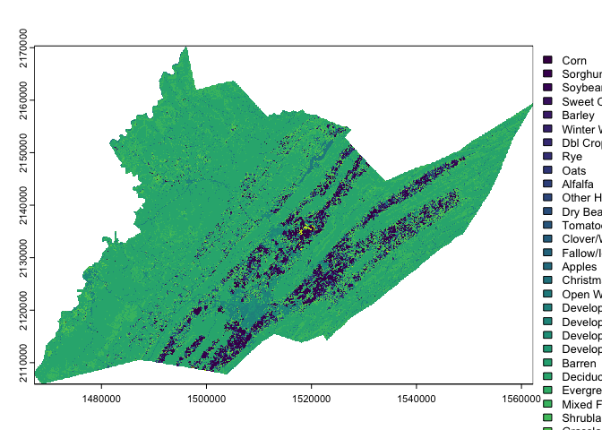
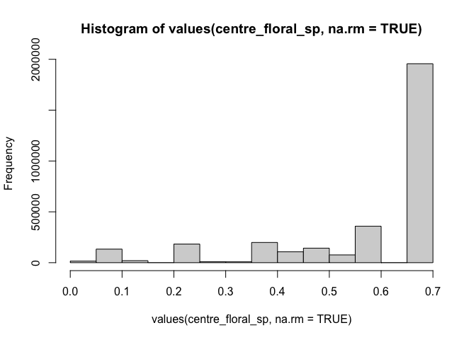

<!-- README.md is generated from README.Rmd. Please edit that file -->

# EcoSpatial Summit Workshop

This workshop is designed to introduce users to the new
<a href="https://beesuite.psu.edu/beeshiny/"
target="_blank"><strong>beeshiny app</strong></a>.

beeshiny can be used to query data commonly used when modeling the
environemental drivers of species’ or commmunity responses. beeshiny was
originally build as a companion to
<a href="https://beescape.psu.edu/" target="_blank">Beescape</a>.

beeshiny allows users to extract:

- climate data: monthly precipitation, min, and max temperature from
  PRISM
- crop land covers: from the NASS CropLand Data Layer
- beescape indices: spring forage, summer forage, fall forage, nesting,
  and pesticides

## Nomenclature

- **raster:** A form of geographic data that represents the landscape as
  a grid of cells. Grid values can be continuous values, signifying
  things like elevation, temperature, or spectral information
  (e.g. color) in a satellite image; or categorical values, signifying
  thematic classes like land cover.
- **vector:** Another form of geographic data that represents specific
  features on the landscape composed of discrete geometric locations
  that consist of x and y values. These can be points, lines, or
  polygons.
- **Cropland Data Layer (CDL):** A set of raster datasets produced by
  the USDA Nationa Agricultural Statistics (NASS) Service and
  Agricultural Research Service (ARS) that represents annual
  crop-specific land cover produced from satellite imagery and ground
  reference data.

## Data Details

- We will use data downloaded from the
  <a href="https://beesuite.psu.edu/beeshiny/"
  target="_blank"><strong>beeshiny app</strong></a>.

- We will also use point data representing hypothetical sites in Centre
  County, PA, which can be downloaded from this repository at
  `/data/centre_co_pts.csv`.

- *Note that if you are unable to access the data on beeshiny, backup
  data are available in the repository in* `data/backups`

## Load packages

There are a number of packages in R that are helpful in working with
spatial data. For this workshop we will be using `sf` and `terra`. For
data wrangling and visualizations we will use `dplyr`, `ggplot2` and
`tidyterra`.

| Name | Description | Link |
|:---|:---|:---|
| `dplyr` | Package that provides a ‘grammar’ of data manipulation in `R` | <https://dplyr.tidyverse.org/> |
| `ggplot2` | Package that provides a system for declaratively creating graphics | <https://ggplot2.tidyverse.org/> |
| `sf` | Package for manipulating 2-D geographic vector data | <https://r-spatial.github.io/sf/> |
| `terra` | Package for spatial data analysis | <https://rspatial.github.io/terra/> |
| `tidyterra` | Package for integrating objects from `terra` with the `dplyr` and `ggplot2` packages | <https://dieghernan.github.io/tidyterra/> |

Because some spatial functions have the same names as dplyr functions it
is helpful to load the spatial packages last. We can also use the `::`
to specify the package for function calls.

Unhash (remove the preceding `#`) and use install.packages for any
packages your may not already have installed

``` r
# install.packages("dplyr", dependencies = TRUE)
# install.packages("ggplot2", dependencies = TRUE)
# install.packages("sf", dependencies = TRUE)
# install.packages("terra", dependencies = TRUE)
# install.packages("tidyterra", dependencies = TRUE)

library(dplyr)
library(ggplot2)
library(sf)
library(terra)
library(tidyterra)
```

# Working with raster data in R

## Get raster data from beeshiny

Use <a href="https://beesuite.psu.edu/beeshiny/"
target="_blank"><strong>beeshiny</strong></a> to download the cropland
data layer (CDL) raster for **Centre County, Pennsylvania** for the year
**2021**.

## Read in raster data

Downloaded data from beeshiny is packaged as a zipped file called
data.zip. Inside this file you should have a .tif file. The name
indicates the data type, in this case CDL, the year and the FIPS code
that corresponds to the county you selected.

**For the code below to work, you must move the .tif file into the
`/data` folder in your ecospatial-workshop directory.**

The first thing we will do is use the `rast()` function to read the .tif
file into R as a `SpatRaster` object. NOTE: if you aren’t able to
download the raster from beeshiny, you can access a pre-downloaded copy
in the `data/backups/` folder.

``` r
centre_cdl <- rast("data/CDL_2021_FIPS_42027.tif")    # add `backup/` after data to use backup data

centre_cdl
#> class       : SpatRaster 
#> dimensions  : 2147, 3167, 1  (nrow, ncol, nlyr)
#> resolution  : 30, 30  (x, y)
#> extent      : 1467225, 1562235, 2105925, 2170335  (xmin, xmax, ymin, ymax)
#> coord. ref. : NAD83 / Conus Albers (EPSG:5070) 
#> source      : CDL_2021_FIPS_42027.tif 
#> name        : Class_Names 
#> min value   :           1 
#> max value   :         254
```

An important attribute of spatial data are their Coordinate Reference
System or CRS. This information tells us what model of the earth (ex
WGS84 or NAD83) is being referenced as well as the units of the
coordinates such as decimal degrees.

Rasters downloaded from beeshiny inherit their CRS from the raster they
were originally extracted from.

Let’s view the CRS for your county cdl:

``` r
crs(centre_cdl)
#> [1] "PROJCRS[\"NAD83 / Conus Albers\",\n    BASEGEOGCRS[\"NAD83\",\n        DATUM[\"North American Datum 1983\",\n            ELLIPSOID[\"GRS 1980\",6378137,298.257222101,\n                LENGTHUNIT[\"metre\",1]]],\n        PRIMEM[\"Greenwich\",0,\n            ANGLEUNIT[\"degree\",0.0174532925199433]],\n        ID[\"EPSG\",4269]],\n    CONVERSION[\"Conus Albers\",\n        METHOD[\"Albers Equal Area\",\n            ID[\"EPSG\",9822]],\n        PARAMETER[\"Latitude of false origin\",23,\n            ANGLEUNIT[\"degree\",0.0174532925199433],\n            ID[\"EPSG\",8821]],\n        PARAMETER[\"Longitude of false origin\",-96,\n            ANGLEUNIT[\"degree\",0.0174532925199433],\n            ID[\"EPSG\",8822]],\n        PARAMETER[\"Latitude of 1st standard parallel\",29.5,\n            ANGLEUNIT[\"degree\",0.0174532925199433],\n            ID[\"EPSG\",8823]],\n        PARAMETER[\"Latitude of 2nd standard parallel\",45.5,\n            ANGLEUNIT[\"degree\",0.0174532925199433],\n            ID[\"EPSG\",8824]],\n        PARAMETER[\"Easting at false origin\",0,\n            LENGTHUNIT[\"metre\",1],\n            ID[\"EPSG\",8826]],\n        PARAMETER[\"Northing at false origin\",0,\n            LENGTHUNIT[\"metre\",1],\n            ID[\"EPSG\",8827]]],\n    CS[Cartesian,2],\n        AXIS[\"easting (X)\",east,\n            ORDER[1],\n            LENGTHUNIT[\"metre\",1]],\n        AXIS[\"northing (Y)\",north,\n            ORDER[2],\n            LENGTHUNIT[\"metre\",1]],\n    USAGE[\n        SCOPE[\"Data analysis and small scale data presentation for contiguous lower 48 states.\"],\n        AREA[\"United States (USA) - CONUS onshore - Alabama; Arizona; Arkansas; California; Colorado; Connecticut; Delaware; Florida; Georgia; Idaho; Illinois; Indiana; Iowa; Kansas; Kentucky; Louisiana; Maine; Maryland; Massachusetts; Michigan; Minnesota; Mississippi; Missouri; Montana; Nebraska; Nevada; New Hampshire; New Jersey; New Mexico; New York; North Carolina; North Dakota; Ohio; Oklahoma; Oregon; Pennsylvania; Rhode Island; South Carolina; South Dakota; Tennessee; Texas; Utah; Vermont; Virginia; Washington; West Virginia; Wisconsin; Wyoming.\"],\n        BBOX[24.41,-124.79,49.38,-66.91]],\n    ID[\"EPSG\",5070]]"
```

We can see that our CDL raster is using the North American Datum of 1983
as its model for the shape of the earth. Our two-dimensional projection
model of earth’s 3d surface is Alber’s Equal Area and the units of our
coordinates are in meters.

## Visualize raster data

We can visualize our county CDl raster by using the base R `plot`
function:

``` r
plot(centre_cdl)
```

<!-- -->

We’ll talk about other plotting options such as using the packages
`ggplot2` and `tidyterra` a little later.

### Reclass to named CDL classes

Right now we are viewing the raw numeric codes of the CDL. These codes
mean something: the crop land cover class. We can tell `terra` what
these codes mean so that it will show the land cover class names rather
than the raw values. The information for these land cover values (along
with their colors) are stored in the color table in
`data/cdl_colormap.csv`.

``` r
cdl_colormap <- read.csv("data/cdl_colormap.csv")   # read in the table

head(cdl_colormap)  # use `head()` to take a look at the first 5 rows of cdl_colormap
#>   value red green blue alpha class_name
#> 1     0   0     0    0   255 Background
#> 2     1 255   211    0   255       Corn
#> 3     2 255    38   38   255     Cotton
#> 4     3   0   168  228   255       Rice
#> 5     4 255   158   11   255    Sorghum
#> 6     5  38   112    0   255   Soybeans
```

**Question:** Which column represents the raw CDL values and which
column represents their land cover class?

We set the levels of the raster to the land cover class names using the
relevant elements of `cdl_colormap`: ‘value’ (column 1) and ‘class_name’
(column 6).

``` r
levels(centre_cdl) <- cdl_colormap[,c(1,6)]

plot(centre_cdl)  # plot, as above, but now R knows what the numeric values mean
```

<!-- -->

Then we can recolor the classes to match the traditional <a
href="https://www.nass.usda.gov/Research_and_Science/Cropland/docs/US_2023_CDL_legend.jpg"
target="_blank">NASS CDL style</a>.

This color information is stored in columns 2-5 of the `cdl_colormap`
table, representing red, green, blue, and alpha (transparency) values.
We use the function `coltab` to supply the color map with this
information in columns that are in this specific order, plus the
corresponding (raw) raster value as the first column (they are already
set up as the first 5 columns of `cdl_colormap`)

``` r
coltab(centre_cdl) <- cdl_colormap[,1:5]

plot(centre_cdl)  # plot, as above, but now R knows what the numeric values mean and assigns colors
```

<!-- -->

Let’s look at some customization options. To do this, we’ll be using the
`ggplot2` `tidyterra` packages. `ggplot2` plots a little differently
from base R. Data elements are layered on top of a base plot using `+`
signs and functions that start with `geom_`. Here, we’re starting with a
blank base plot and adding the spatraster object using
`geom_spatraster()`.

``` r
ggplot() +  # blank base plot
  geom_spatraster(data = centre_cdl, aes(fill = class_name))   # add the spatraster layer
```

<!-- -->

The legend is now quite large but can be easily modified using `ggplot2`
`theme` functions.

``` r
ggplot() +
  geom_spatraster(data = centre_cdl, aes(fill = class_name)) +
  theme(legend.title = element_text(size = 7), # make legend title smaller
        legend.text = element_text(size = 7), # make legend text smaller
        legend.key.size = unit(0.25, 'cm'), #make legend color keys smaller
        legend.position="bottom") # move legend to the bottom of the plot
```

<!-- -->

### Reclass crop land cover to spring floral resources

Up to know, our CDL raster values are still numeric values that
represent crop land cover class from the CDL. We can reclassify these
CDL values to the estimated floral resources of each land cover class,
based on <a href="https://www.pnas.org/doi/abs/10.1073/pnas.1517685113"
target="_blank">Koh et al. (2015)</a>.

A reclassification table based on Koh et al. is in the `data/` folder.
The table rows connect each CDL value to its corresponding class name
and the values for several indices.

``` r
reclass_table <- read.csv("data/cdl_reclass_koh.csv")  # read in the reclassification table

head(reclass_table)     # take a look at the first 5 rows
#>   value class_name nesting_ground_availability_index
#> 1     0 Background                         0.0000000
#> 2     1       Corn                         0.1451854
#> 3     2     Cotton                         0.3355898
#> 4     3       Rice                         0.1513067
#> 5     4    Sorghum                         0.1451854
#> 6     5   Soybeans                         0.1993286
#>   nesting_cavity_availability_index nesting_stem_availability_index
#> 1                        0.00000000                       0.0000000
#> 2                        0.08947642                       0.1069437
#> 3                        0.22867787                       0.2335293
#> 4                        0.13945144                       0.1089976
#> 5                        0.08947642                       0.1069437
#> 6                        0.11568643                       0.1263174
#>   nesting_wood_availability_index floral_resources_spring_index
#> 1                       0.0000000                    0.00000000
#> 2                       0.1026114                    0.09025383
#> 3                       0.2774442                    0.39644857
#> 4                       0.1024528                    0.11008896
#> 5                       0.1026114                    0.09025383
#> 6                       0.1470606                    0.24359554
#>   floral_resources_summer_index floral_resources_fall_index
#> 1                     0.0000000                   0.0000000
#> 2                     0.2747074                   0.1323095
#> 3                     0.3160415                   0.1655815
#> 4                     0.2821817                   0.1334781
#> 5                     0.2747074                   0.1323095
#> 6                     0.3971508                   0.1858675
```

A reclassification table assigns the original values of a raster (listed
in the first column) to a new value (listed in the second column). This
is done using the `classify()` function.

We will select the columns corresponding to the CDL value and the spring
floral resources as our original and new values, respectively, for our
reclass table. We’ll reclassify the Centre County CDL and generate a map
of spring floral resources across the county.

``` r
centre_floral_sp <- classify(centre_cdl,
                    reclass_table[,c("value",
                                     "floral_resources_spring_index")])

plot(centre_floral_sp)
```

<!-- -->

## Inspect raster values

Using the `values()` function we can directly inspect the spring floral
values for Centre County. We will set the argument `na.rm=TRUE` so that
all the empty cells (outside of the county) are not included. The result
of `values()` shows individual grid cell values. In this case we will
only extract the first 20 grid cell values.

``` r
values(centre_floral_sp, na.rm=TRUE)[1:20]   # just the first 20 cells
#>  [1] 0.5848480 0.0000000 0.6965277 0.5848480 0.0000000 0.0000000 0.6965277
#>  [8] 0.5848480 0.0000000 0.0000000 0.6965277 0.6965277 0.6965277 0.0000000
#> [15] 0.0000000 0.0000000 0.6965277 0.6965277 0.5848480 0.0000000
```

We can also use some basic summary functions to view the distribution of
floral resource values for the county.

``` r
summary(values(centre_floral_sp, na.rm=TRUE))    # make a summary with the quartiles and the mean
#>    class_name    
#>  Min.   :0.0000  
#>  1st Qu.:0.4558  
#>  Median :0.6965  
#>  Mean   :0.5813  
#>  3rd Qu.:0.6965  
#>  Max.   :0.6993

hist(values(centre_floral_sp, na.rm=TRUE))       # make a basic histogram of values
```

<!-- -->

## Write out raster files

We can save our raster files as a .tif using `writeRaster`. For the CDL
raster we will save the data in “INT1U” format which will also save the
class names and color table.

``` r
writeRaster(centre_cdl, "data/centre_county_cdl_2015.tif", overwrite=TRUE, datatype="INT1U")

writeRaster(centre_floral_sp, "data/centre_county_springfloral_2015.tif", overwrite=TRUE)
```

## Check your learning

1.  Use beeshiny to download the CDL raster for another county in the
    continental US for any year you want.

2.  Move the CDL raster for Centre County to the `/data` folder in your
    ecospatial-workshop directory.

3.  Read the raster into R as a terra `SpatRaster` using `rast()`.

4.  Assign the CDL value codes with land cover class names using
    `levels()` and assign colors using `cdl_colormap()`.

``` r

# county_cdl <- rast("data/CDL_2021_FIPS_42027.tif") 

# levels(county_cdl) <- cdl_colormap[,c(1,6)]

# coltab(county_cdl) <- cdl_colormap[,1:5]

# plot(county_cdl)
```

# Working with vector (points and polygons) data

## Read in point data

Often we collect and store point data as coordinates in a non-spatial
format such as a csv file which we need to convert into a spatial object
in R.

In the /data directory you should find a csv file with a set of points
from Centre County Pa. We will read in and inspect these data.

``` r
centre_sites <- read.csv("data/centre_co_pts.csv")
centre_sites
#>   SiteID      Long      Lat
#> 1  Site1 -77.70654 40.80497
#> 2  Site2 -77.89991 40.74921
#> 3  Site3 -77.93778 41.00641
#> 4  Site4 -77.86590 40.81954
#> 5  Site5 -77.64715 41.02197
#> 6  Site6 -77.84409 40.87366
#> 7  Site7 -77.77373 40.82634
#> 8  Site8 -77.69934 40.87697
```

and convert them into an sf spatial object. We use the `coords=`
argument to indicate the columns that hold the longitude (X) and
latitude (Y). We can also specify the CRS using the ‘crs=’ arguments and
the appropriate EPSG code or other crs object. In our case we will give
the EPSG code 4326 which corresponds to WGS 84, the system commonly used
by Google Earth.

``` r
centre_sites <- st_as_sf(centre_sites, 
                         coords=c("Long","Lat"), #indicate the x and y columns
                         crs = 4326) #set the crs
```

when we inspect the center_sites object we see that there is now
additional information at the top.

``` r
centre_sites
#> Simple feature collection with 8 features and 1 field
#> Geometry type: POINT
#> Dimension:     XY
#> Bounding box:  xmin: -77.93778 ymin: 40.74921 xmax: -77.64715 ymax: 41.02197
#> Geodetic CRS:  WGS 84
#>   SiteID                   geometry
#> 1  Site1 POINT (-77.70654 40.80497)
#> 2  Site2 POINT (-77.89991 40.74921)
#> 3  Site3 POINT (-77.93778 41.00641)
#> 4  Site4  POINT (-77.8659 40.81954)
#> 5  Site5 POINT (-77.64715 41.02197)
#> 6  Site6 POINT (-77.84409 40.87366)
#> 7  Site7 POINT (-77.77373 40.82634)
#> 8  Site8 POINT (-77.69934 40.87697)
```

## Visualize point data

Using `ggplot2` and `sf` we can add our points to our earlier map of
Centre county with the `geom_sf()` function.

``` r
#Centre county CDL from raster exercise
centre_cdl <- rast("data/centre_county_cdl_2015.tif") 

ggplot()+
  geom_spatraster(data = centre_cdl, aes(fill = class_name)) +
  geom_sf(data=centre_sites) + 
  theme(legend.title = element_text(size = 7), 
        legend.text = element_text(size = 7), 
        legend.key.size = unit(0.25, 'cm'),
        legend.position="bottom") 
```

<!-- -->

## Buffer around points

We can create a polygon object from our points by buffering around them
in a 1000m radius. For example, we might do this when assessing land
cover values around a site.

``` r
centre_sites_1000m <- st_buffer(centre_sites, 1000)
centre_sites_1000m
#> Simple feature collection with 8 features and 1 field
#> Geometry type: POLYGON
#> Dimension:     XY
#> Bounding box:  xmin: -77.94977 ymin: 40.74008 xmax: -77.63518 ymax: 41.03112
#> Geodetic CRS:  WGS 84
#>   SiteID                       geometry
#> 1  Site1 POLYGON ((-77.70945 40.8137...
#> 2  Site2 POLYGON ((-77.90568 40.7412...
#> 3  Site3 POLYGON ((-77.92781 41.0013...
#> 4  Site4 POLYGON ((-77.85495 40.8230...
#> 5  Site5 POLYGON ((-77.65648 41.0163...
#> 6  Site6 POLYGON ((-77.84816 40.8651...
#> 7  Site7 POLYGON ((-77.76805 40.8184...
#> 8  Site8 POLYGON ((-77.69978 40.886,...
```

We can visualize this buffer by adding it to our plot. Note you may need
to expand your plot size to see the buffers behind the points.

``` r
ggplot()+
  geom_spatraster(data = centre_cdl, aes(fill = class_name)) +
  geom_sf(data = centre_sites_1000m)+
  geom_sf(data=centre_sites) + 
  theme(legend.title = element_text(size = 7), 
        legend.text = element_text(size = 7), 
        legend.key.size = unit(0.25, 'cm'),
        legend.position="bottom") 
```

<!-- -->

## Extract CDL values within buffers

If we wanted to assess land cover around a site in a way that is similar
to the results that beeshiny provides, we can use the `extract()`
function from terra. First providing the raster we want to extract
values from, then the sf object that defines the zones in which the
raster will the summarized.

``` r
centre_table_1000m <- extract(centre_cdl, centre_sites_1000m, fun="table", ID=F)
centre_table_1000m
#>   Background Corn Cotton Rice Sorghum Soybeans Sunflower Peanuts Tobacco
#> 1          0 1240      0    0      12     1021         0       0       0
#> 2          0 1168      0    0       0      968         0       0       0
#> 3          0    0      0    0       0        0         0       0       0
#> 4          0   64      0    0       0       80         0       0       0
#> 5          0   18      0    0       1        5         0       0       0
#> 6          0  882      0    0       1      836         0       0       0
#> 7          0    0      0    0       0        0         0       0       0
#> 8          0   92      0    0       0        0         0       0       0
#>   Sweet Corn Pop or Orn Corn Mint Barley Durum Wheat Spring Wheat Winter Wheat
#> 1          0               0    0      0           0            0          225
#> 2          0               0    0      7           0            0          445
#> 3          0               0    0      0           0            0            0
#> 4          0               0    0      1           0            0            7
#> 5          0               0    0      0           0            0            1
#> 6          0               0    0      1           0            0           24
#> 7          0               0    0      0           0            0            0
#> 8          0               0    0      0           0            0            0
#>   Other Small Grains Dbl Crop WinWht/Soybeans Rye Oats Millet Speltz Canola
#> 1                  0                        0   2   20      0      0      0
#> 2                  0                        0   7  136      0      0      0
#> 3                  0                        0   0    0      0      0      0
#> 4                  0                        0   0    0      0      0      0
#> 5                  0                        0   0    0      0      0      0
#> 6                  0                        0   0    0      0      0      0
#> 7                  0                        0   0    0      0      0      0
#> 8                  0                        0   0    0      0      0      0
#>   Flaxseed Safflower Rape Seed Mustard Alfalfa Other Hay/Non Alfalfa Camelina
#> 1        0         0         0       0     156                    88        0
#> 2        0         0         0       0     100                    29        0
#> 3        0         0         0       0       0                     0        0
#> 4        0         0         0       0      82                   410        0
#> 5        0         0         0       0       2                    50        0
#> 6        0         0         0       0     124                   407        0
#> 7        0         0         0       0       0                     0        0
#> 8        0         0         0       0       4                    25        0
#>   Buckwheat Sugarbeets Dry Beans Potatoes Other Crops Sugarcane Sweet Potatoes
#> 1         0          0        43        0           0         0              0
#> 2         0          0       118        0           0         0              0
#> 3         0          0         0        0           0         0              0
#> 4         0          0         0        0           0         0              0
#> 5         0          0         1        0           0         0              0
#> 6         0          0         0        0           0         0              0
#> 7         0          0         0        0           0         0              0
#> 8         0          0         0        0           0         0              0
#>   Misc Vegs & Fruits Watermelons Onions Cucumbers Chick Peas Lentils Peas
#> 1                  0           0      0         0          0       0    0
#> 2                  0           0      0         0          0       0    0
#> 3                  0           0      0         0          0       0    0
#> 4                  0           0      0         0          0       0    0
#> 5                  0           0      0         0          0       0    0
#> 6                  0           0      0         0          0       0    0
#> 7                  0           0      0         0          0       0    0
#> 8                  0           0      0         0          0       0    0
#>   Tomatoes Caneberries Hops Herbs Clover/Wildflowers Sod/Grass Seed Switchgrass
#> 1        0           0    0     0                  0              0           0
#> 2        0           0    0     0                  0              0           0
#> 3        0           0    0     0                  0              0           0
#> 4        1           0    0     0                  0              0           0
#> 5        1           0    0     0                  0              0           0
#> 6        0           0    0     0                  0              0           0
#> 7        0           0    0     0                  0              0           0
#> 8        0           0    0     0                  0              0           0
#>   Fallow/Idle Cropland Forest Cherries Peaches Apples Grapes Christmas Trees
#> 1                    0      0        0       0      0      0               0
#> 2                    0      0        0       0      0      0               0
#> 3                    0      0        0       0      0      0               0
#> 4                    0      0        0       0      1      0               0
#> 5                    0      0        0       0      0      0               0
#> 6                    0      0        0       0      1      0               0
#> 7                    0      0        0       0      0      0               0
#> 8                    0      0        0       0      0      0               0
#>   Other Tree Crops Citrus Pecans Almonds Walnuts Pears Clouds/No Data Developed
#> 1                0      0      0       0       0     0              0         0
#> 2                0      0      0       0       0     0              0         0
#> 3                0      0      0       0       0     0              0         0
#> 4                0      0      0       0       0     0              0         0
#> 5                0      0      0       0       0     0              0         0
#> 6                0      0      0       0       0     0              0         0
#> 7                0      0      0       0       0     0              0         0
#> 8                0      0      0       0       0     0              0         0
#>   Water Wetlands Nonag/Undefined Aquaculture Open Water Perennial Ice/Snow
#> 1     0        0               0           0          0                  0
#> 2     0        0               0           0          0                  0
#> 3     0        0               0           0          0                  0
#> 4     0        0               0           0          0                  0
#> 5     0        0               0           0       1621                  0
#> 6     0        0               0           0          0                  0
#> 7     0        0               0           0          0                  0
#> 8     0        0               0           0          0                  0
#>   Developed/Open Space Developed/Low Intensity Developed/Med Intensity
#> 1                  224                      69                      22
#> 2                   52                      95                      45
#> 3                  208                       9                       2
#> 4                  298                     367                     401
#> 5                  172                      95                      33
#> 6                  299                     214                      22
#> 7                  135                       1                       0
#> 8                  162                       8                       1
#>   Developed/High Intensity Barren Deciduous Forest Evergreen Forest
#> 1                        2      4              178               10
#> 2                        8      0              116                1
#> 3                        0      0             3264                1
#> 4                      137      1              474              106
#> 5                        0      7              391               35
#> 6                        4      1              236                6
#> 7                        0      0             3358                9
#> 8                        0      7             2217              533
#>   Mixed Forest Shrubland Grassland/Pasture Woody Wetlands Herbaceous Wetlands
#> 1           22         0               213              0                   0
#> 2           12         0               241              0                   0
#> 3           56         0                 9              0                   0
#> 4          303         1               806              0                   0
#> 5          692         1               415              5                   1
#> 6           56         1               437              0                   0
#> 7           37         5                 4              0                   0
#> 8          458         1                36              5                   0
#>   Pistachios Triticale Carrots Asparagus Garlic Cantaloupes Prunes Olives
#> 1          0         0       0         0      0           0      0      0
#> 2          0         2       0         0      0           0      0      0
#> 3          0         0       0         0      0           0      0      0
#> 4          0         1       0         0      0           0      0      0
#> 5          0         1       0         0      0           0      0      0
#> 6          0         0       0         0      0           0      0      0
#> 7          0         0       0         0      0           0      0      0
#> 8          0         0       0         0      0           0      0      0
#>   Oranges Honeydew Melons Broccoli Avocados Peppers Pomegranates Nectarines
#> 1       0               0        0        0       0            0          0
#> 2       0               0        0        0       0            0          0
#> 3       0               0        0        0       0            0          0
#> 4       0               0        0        0       0            0          0
#> 5       0               0        0        0       0            0          0
#> 6       0               0        0        0       0            0          0
#> 7       0               0        0        0       0            0          0
#> 8       0               0        0        0       0            0          0
#>   Greens Plums Strawberries Squash Apricots Vetch Dbl Crop WinWht/Corn
#> 1      0     0            0      0        0     0                    0
#> 2      0     0            0      0        0     0                    2
#> 3      0     0            0      0        0     0                    0
#> 4      0     0            0      0        0     0                    3
#> 5      0     0            0      0        0     0                    0
#> 6      0     0            0      0        0     0                    0
#> 7      0     0            0      0        0     0                    0
#> 8      0     0            0      0        0     0                    0
#>   Dbl Crop Oats/Corn Lettuce Dbl Crop Triticale/Corn Pumpkins
#> 1                  0       0                       0        0
#> 2                  0       0                       0        0
#> 3                  0       0                       0        0
#> 4                  0       0                       1        1
#> 5                  1       0                       0        0
#> 6                  0       0                       0        0
#> 7                  0       0                       0        0
#> 8                  0       0                       0        0
#>   Dbl Crop Lettuce/Durum Wht Dbl Crop Lettuce/Cantaloupe
#> 1                          0                           0
#> 2                          0                           0
#> 3                          0                           0
#> 4                          0                           0
#> 5                          0                           0
#> 6                          0                           0
#> 7                          0                           0
#> 8                          0                           0
#>   Dbl Crop Lettuce/Cotton Dbl Crop Lettuce/Barley Dbl Crop Durum Wht/Sorghum
#> 1                       0                       0                          0
#> 2                       0                       0                          0
#> 3                       0                       0                          0
#> 4                       0                       0                          0
#> 5                       0                       0                          0
#> 6                       0                       0                          0
#> 7                       0                       0                          0
#> 8                       0                       0                          0
#>   Dbl Crop Barley/Sorghum Dbl Crop WinWht/Sorghum Dbl Crop Barley/Corn
#> 1                       0                       0                    0
#> 2                       0                       0                    0
#> 3                       0                       0                    0
#> 4                       0                       1                    0
#> 5                       0                       0                    0
#> 6                       0                       0                    0
#> 7                       0                       0                    0
#> 8                       0                       0                    0
#>   Dbl Crop WinWht/Cotton Dbl Crop Soybeans/Cotton Dbl Crop Soybeans/Oats
#> 1                      0                        0                      0
#> 2                      0                        0                      0
#> 3                      0                        0                      0
#> 4                      0                        0                      0
#> 5                      0                        0                      0
#> 6                      0                        0                      0
#> 7                      0                        0                      0
#> 8                      0                        0                      0
#>   Dbl Crop Corn/Soybeans Blueberries Cabbage Cauliflower Celery Radishes
#> 1                      0           0       0           0      0        0
#> 2                      0           0       0           0      0        0
#> 3                      0           0       0           0      0        0
#> 4                      0           0       0           0      0        0
#> 5                      0           0       0           0      0        0
#> 6                      0           0       0           0      0        0
#> 7                      0           0       0           0      0        0
#> 8                      0           0       0           0      0        0
#>   Turnips Eggplants Gourds Cranberries Dbl Crop Barley/Soybeans
#> 1       0         0      0           0                        0
#> 2       0         0      0           0                        0
#> 3       0         0      0           0                        0
#> 4       0         0      0           0                        0
#> 5       0         0      0           0                        0
#> 6       0         0      0           0                        0
#> 7       0         0      0           0                        0
#> 8       0         0      0           0                        0
```

We can calculate additional statistics such as the area within the
buffer for each site.

``` r
Area_m2 <- rowSums(centre_table_1000m)*900
```

and turn our table into proportional cover of different land classes.

``` r
centre_table_1000m_prop <- centre_table_1000m/rowSums(centre_table_1000m)

centre_table_1000m_prop <- cbind(Area_m2,centre_table_1000m_prop)
centre_table_1000m_prop
#>   Area_m2 Background        Corn Cotton Rice      Sorghum    Soybeans Sunflower
#> 1 3195900          0 0.349197409      0    0 0.0033793298 0.287524641         0
#> 2 3196800          0 0.328828829      0    0 0.0000000000 0.272522523         0
#> 3 3194100          0 0.000000000      0    0 0.0000000000 0.000000000         0
#> 4 3192300          0 0.018043417      0    0 0.0000000000 0.022554271         0
#> 5 3194100          0 0.005071851      0    0 0.0002817695 0.001408848         0
#> 6 3196800          0 0.248310811      0    0 0.0002815315 0.235360360         0
#> 7 3194100          0 0.000000000      0    0 0.0000000000 0.000000000         0
#> 8 3194100          0 0.025922795      0    0 0.0000000000 0.000000000         0
#>   Peanuts Tobacco Sweet Corn Pop or Orn Corn Mint       Barley Durum Wheat
#> 1       0       0          0               0    0 0.0000000000           0
#> 2       0       0          0               0    0 0.0019707207           0
#> 3       0       0          0               0    0 0.0000000000           0
#> 4       0       0          0               0    0 0.0002819284           0
#> 5       0       0          0               0    0 0.0000000000           0
#> 6       0       0          0               0    0 0.0002815315           0
#> 7       0       0          0               0    0 0.0000000000           0
#> 8       0       0          0               0    0 0.0000000000           0
#>   Spring Wheat Winter Wheat Other Small Grains Dbl Crop WinWht/Soybeans
#> 1            0 0.0633624331                  0                        0
#> 2            0 0.1252815315                  0                        0
#> 3            0 0.0000000000                  0                        0
#> 4            0 0.0019734987                  0                        0
#> 5            0 0.0002817695                  0                        0
#> 6            0 0.0067567568                  0                        0
#> 7            0 0.0000000000                  0                        0
#> 8            0 0.0000000000                  0                        0
#>            Rye        Oats Millet Speltz Canola Flaxseed Safflower Rape Seed
#> 1 0.0005632216 0.005632216      0      0      0        0         0         0
#> 2 0.0019707207 0.038288288      0      0      0        0         0         0
#> 3 0.0000000000 0.000000000      0      0      0        0         0         0
#> 4 0.0000000000 0.000000000      0      0      0        0         0         0
#> 5 0.0000000000 0.000000000      0      0      0        0         0         0
#> 6 0.0000000000 0.000000000      0      0      0        0         0         0
#> 7 0.0000000000 0.000000000      0      0      0        0         0         0
#> 8 0.0000000000 0.000000000      0      0      0        0         0         0
#>   Mustard     Alfalfa Other Hay/Non Alfalfa Camelina Buckwheat Sugarbeets
#> 1       0 0.043931287           0.024781752        0         0          0
#> 2       0 0.028153153           0.008164414        0         0          0
#> 3       0 0.000000000           0.000000000        0         0          0
#> 4       0 0.023118128           0.115590640        0         0          0
#> 5       0 0.000563539           0.014088476        0         0          0
#> 6       0 0.034909910           0.114583333        0         0          0
#> 7       0 0.000000000           0.000000000        0         0          0
#> 8       0 0.001127078           0.007044238        0         0          0
#>      Dry Beans Potatoes Other Crops Sugarcane Sweet Potatoes Misc Vegs & Fruits
#> 1 0.0121092650        0           0         0              0                  0
#> 2 0.0332207207        0           0         0              0                  0
#> 3 0.0000000000        0           0         0              0                  0
#> 4 0.0000000000        0           0         0              0                  0
#> 5 0.0002817695        0           0         0              0                  0
#> 6 0.0000000000        0           0         0              0                  0
#> 7 0.0000000000        0           0         0              0                  0
#> 8 0.0000000000        0           0         0              0                  0
#>   Watermelons Onions Cucumbers Chick Peas Lentils Peas     Tomatoes Caneberries
#> 1           0      0         0          0       0    0 0.0000000000           0
#> 2           0      0         0          0       0    0 0.0000000000           0
#> 3           0      0         0          0       0    0 0.0000000000           0
#> 4           0      0         0          0       0    0 0.0002819284           0
#> 5           0      0         0          0       0    0 0.0002817695           0
#> 6           0      0         0          0       0    0 0.0000000000           0
#> 7           0      0         0          0       0    0 0.0000000000           0
#> 8           0      0         0          0       0    0 0.0000000000           0
#>   Hops Herbs Clover/Wildflowers Sod/Grass Seed Switchgrass Fallow/Idle Cropland
#> 1    0     0                  0              0           0                    0
#> 2    0     0                  0              0           0                    0
#> 3    0     0                  0              0           0                    0
#> 4    0     0                  0              0           0                    0
#> 5    0     0                  0              0           0                    0
#> 6    0     0                  0              0           0                    0
#> 7    0     0                  0              0           0                    0
#> 8    0     0                  0              0           0                    0
#>   Forest Cherries Peaches       Apples Grapes Christmas Trees Other Tree Crops
#> 1      0        0       0 0.0000000000      0               0                0
#> 2      0        0       0 0.0000000000      0               0                0
#> 3      0        0       0 0.0000000000      0               0                0
#> 4      0        0       0 0.0002819284      0               0                0
#> 5      0        0       0 0.0000000000      0               0                0
#> 6      0        0       0 0.0002815315      0               0                0
#> 7      0        0       0 0.0000000000      0               0                0
#> 8      0        0       0 0.0000000000      0               0                0
#>   Citrus Pecans Almonds Walnuts Pears Clouds/No Data Developed Water Wetlands
#> 1      0      0       0       0     0              0         0     0        0
#> 2      0      0       0       0     0              0         0     0        0
#> 3      0      0       0       0     0              0         0     0        0
#> 4      0      0       0       0     0              0         0     0        0
#> 5      0      0       0       0     0              0         0     0        0
#> 6      0      0       0       0     0              0         0     0        0
#> 7      0      0       0       0     0              0         0     0        0
#> 8      0      0       0       0     0              0         0     0        0
#>   Nonag/Undefined Aquaculture Open Water Perennial Ice/Snow
#> 1               0           0  0.0000000                  0
#> 2               0           0  0.0000000                  0
#> 3               0           0  0.0000000                  0
#> 4               0           0  0.0000000                  0
#> 5               0           0  0.4567484                  0
#> 6               0           0  0.0000000                  0
#> 7               0           0  0.0000000                  0
#> 8               0           0  0.0000000                  0
#>   Developed/Open Space Developed/Low Intensity Developed/Med Intensity
#> 1           0.06308082            0.0194311462            0.0061954379
#> 2           0.01463964            0.0267454955            0.0126689189
#> 3           0.05860806            0.0025359256            0.0005635390
#> 4           0.08401466            0.1034677192            0.1130532845
#> 5           0.04846436            0.0267681037            0.0092983939
#> 6           0.08417793            0.0602477477            0.0061936937
#> 7           0.03803888            0.0002817695            0.0000000000
#> 8           0.04564666            0.0022541561            0.0002817695
#>   Developed/High Intensity       Barren Deciduous Forest Evergreen Forest
#> 1             0.0005632216 0.0011264433       0.05012672     0.0028161081
#> 2             0.0022522523 0.0000000000       0.03265766     0.0002815315
#> 3             0.0000000000 0.0000000000       0.91969569     0.0002817695
#> 4             0.0386241895 0.0002819284       0.13363406     0.0298844094
#> 5             0.0000000000 0.0019723866       0.11017188     0.0098619329
#> 6             0.0011261261 0.0002815315       0.06644144     0.0016891892
#> 7             0.0000000000 0.0000000000       0.94618202     0.0025359256
#> 8             0.0000000000 0.0019723866       0.62468301     0.1501831502
#>   Mixed Forest    Shrubland Grassland/Pasture Woody Wetlands
#> 1  0.006195438 0.0000000000       0.059983103    0.000000000
#> 2  0.003378378 0.0000000000       0.067849099    0.000000000
#> 3  0.015779093 0.0000000000       0.002535926    0.000000000
#> 4  0.085424302 0.0002819284       0.227234282    0.000000000
#> 5  0.194984503 0.0002817695       0.116934348    0.001408848
#> 6  0.015765766 0.0002815315       0.123029279    0.000000000
#> 7  0.010425472 0.0014088476       0.001127078    0.000000000
#> 8  0.129050437 0.0002817695       0.010143702    0.001408848
#>   Herbaceous Wetlands Pistachios    Triticale Carrots Asparagus Garlic
#> 1        0.0000000000          0 0.0000000000       0         0      0
#> 2        0.0000000000          0 0.0005630631       0         0      0
#> 3        0.0000000000          0 0.0000000000       0         0      0
#> 4        0.0000000000          0 0.0002819284       0         0      0
#> 5        0.0002817695          0 0.0002817695       0         0      0
#> 6        0.0000000000          0 0.0000000000       0         0      0
#> 7        0.0000000000          0 0.0000000000       0         0      0
#> 8        0.0000000000          0 0.0000000000       0         0      0
#>   Cantaloupes Prunes Olives Oranges Honeydew Melons Broccoli Avocados Peppers
#> 1           0      0      0       0               0        0        0       0
#> 2           0      0      0       0               0        0        0       0
#> 3           0      0      0       0               0        0        0       0
#> 4           0      0      0       0               0        0        0       0
#> 5           0      0      0       0               0        0        0       0
#> 6           0      0      0       0               0        0        0       0
#> 7           0      0      0       0               0        0        0       0
#> 8           0      0      0       0               0        0        0       0
#>   Pomegranates Nectarines Greens Plums Strawberries Squash Apricots Vetch
#> 1            0          0      0     0            0      0        0     0
#> 2            0          0      0     0            0      0        0     0
#> 3            0          0      0     0            0      0        0     0
#> 4            0          0      0     0            0      0        0     0
#> 5            0          0      0     0            0      0        0     0
#> 6            0          0      0     0            0      0        0     0
#> 7            0          0      0     0            0      0        0     0
#> 8            0          0      0     0            0      0        0     0
#>   Dbl Crop WinWht/Corn Dbl Crop Oats/Corn Lettuce Dbl Crop Triticale/Corn
#> 1         0.0000000000       0.0000000000       0            0.0000000000
#> 2         0.0005630631       0.0000000000       0            0.0000000000
#> 3         0.0000000000       0.0000000000       0            0.0000000000
#> 4         0.0008457852       0.0000000000       0            0.0002819284
#> 5         0.0000000000       0.0002817695       0            0.0000000000
#> 6         0.0000000000       0.0000000000       0            0.0000000000
#> 7         0.0000000000       0.0000000000       0            0.0000000000
#> 8         0.0000000000       0.0000000000       0            0.0000000000
#>       Pumpkins Dbl Crop Lettuce/Durum Wht Dbl Crop Lettuce/Cantaloupe
#> 1 0.0000000000                          0                           0
#> 2 0.0000000000                          0                           0
#> 3 0.0000000000                          0                           0
#> 4 0.0002819284                          0                           0
#> 5 0.0000000000                          0                           0
#> 6 0.0000000000                          0                           0
#> 7 0.0000000000                          0                           0
#> 8 0.0000000000                          0                           0
#>   Dbl Crop Lettuce/Cotton Dbl Crop Lettuce/Barley Dbl Crop Durum Wht/Sorghum
#> 1                       0                       0                          0
#> 2                       0                       0                          0
#> 3                       0                       0                          0
#> 4                       0                       0                          0
#> 5                       0                       0                          0
#> 6                       0                       0                          0
#> 7                       0                       0                          0
#> 8                       0                       0                          0
#>   Dbl Crop Barley/Sorghum Dbl Crop WinWht/Sorghum Dbl Crop Barley/Corn
#> 1                       0            0.0000000000                    0
#> 2                       0            0.0000000000                    0
#> 3                       0            0.0000000000                    0
#> 4                       0            0.0002819284                    0
#> 5                       0            0.0000000000                    0
#> 6                       0            0.0000000000                    0
#> 7                       0            0.0000000000                    0
#> 8                       0            0.0000000000                    0
#>   Dbl Crop WinWht/Cotton Dbl Crop Soybeans/Cotton Dbl Crop Soybeans/Oats
#> 1                      0                        0                      0
#> 2                      0                        0                      0
#> 3                      0                        0                      0
#> 4                      0                        0                      0
#> 5                      0                        0                      0
#> 6                      0                        0                      0
#> 7                      0                        0                      0
#> 8                      0                        0                      0
#>   Dbl Crop Corn/Soybeans Blueberries Cabbage Cauliflower Celery Radishes
#> 1                      0           0       0           0      0        0
#> 2                      0           0       0           0      0        0
#> 3                      0           0       0           0      0        0
#> 4                      0           0       0           0      0        0
#> 5                      0           0       0           0      0        0
#> 6                      0           0       0           0      0        0
#> 7                      0           0       0           0      0        0
#> 8                      0           0       0           0      0        0
#>   Turnips Eggplants Gourds Cranberries Dbl Crop Barley/Soybeans
#> 1       0         0      0           0                        0
#> 2       0         0      0           0                        0
#> 3       0         0      0           0                        0
#> 4       0         0      0           0                        0
#> 5       0         0      0           0                        0
#> 6       0         0      0           0                        0
#> 7       0         0      0           0                        0
#> 8       0         0      0           0                        0
```

## Write out shapefiles

we can write out vector data to shapefiles using `st_write()`

``` r
st_write(centre_sites, "data/centre_sites.shp")
#> Writing layer `centre_sites' to data source 
#>   `data/centre_sites.shp' using driver `ESRI Shapefile'
#> Writing 8 features with 1 fields and geometry type Point.
st_write(centre_sites_1000m, "data/centre_sites_buffer_1000m.shp")
#> Writing layer `centre_sites_buffer_1000m' to data source 
#>   `data/centre_sites_buffer_1000m.shp' using driver `ESRI Shapefile'
#> Writing 8 features with 1 fields and geometry type Polygon.
```

## Check your learning

1.  Using beeshiny, extract the CDL values for 1km around the centre
    county points for the same year of the CDL that you used in the last
    activity.

2.  Compare the CDL values from beeshiny for the centre county sites to
    the values you produced using the extract function above. Values
    should be similar but not exacly the same because beeshiny uses
    exactextractr (`?exact_extract`) instead of the `terra::extract`
    function.

# Working with climate data

# Bringing it all together
