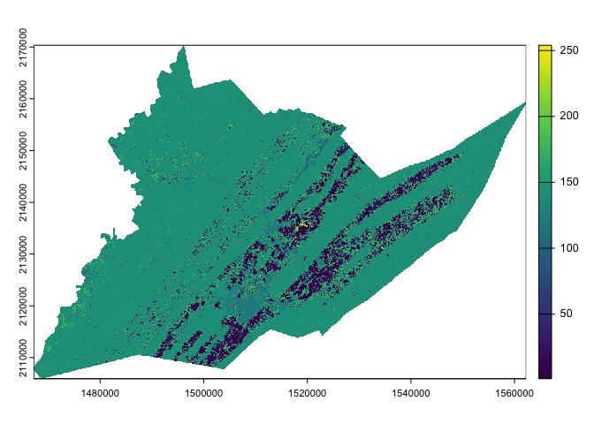
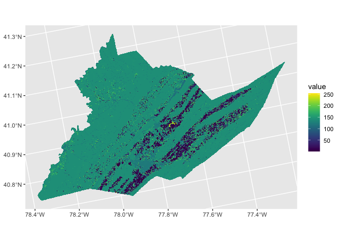

<!-- README.md is generated from README.Rmd. Please edit that file -->

# EcoSpatial Summit Workshop

This workshop is designed to introduce users to the new
[**beeshiny**](https://beesuite.psu.edu/beeshiny/) R shiny application.

[**beeshiny**](https://beesuite.psu.edu/beeshiny/) can be used to query
data commonly used when modeling the environemental drivers of species’
or commmunity responses. beeshiny was originally build as a companion to
[Beescape](https://beescape.psu.edu/).

**beeshiny** allows users to extract:

- climate data: monthly precipitation, min, and max temperature from
  PRISM
- crop land covers: from the NASS CropLand Data Layer
- beescape indices: spring forage, summer forage, fall forage, nesting,
  and pesticides

### Nomenclature

- *raster:* A form of geographic data that represents the landscape as a
  grid of cells. Grid values can be continuous values, signifying things
  like elevation, temperature, or spectral information (e.g. color) in a
  satellite image; or categorical values, signifying thematic classes
  like land cover.
- *vector:* Another form of geographic data that represents specific
  features on the landscape composed of discrete geometric locations
  that consist of x and y values. These can be points, lines, or
  polygons.
- *Cropland Data Layer (CDL):* A set of raster datasets produced by the
  USDA Nationa Agricultural Statistics (NASS) Service and Agricultural
  Research Service (ARS) that represents annual crop-specific land cover
  produced from satellite imagery and ground reference data.

### Data Details

We will use data downloaded from the [**beeshiny
app**](https://beesuite.psu.edu/beeshiny/), along with point data
representing hypothetical sites in Centre County, PA, which can be
downloaded from this repository in the \`/data\`\` folder.

- *Note that if you are unable to access the data on beeshiny, backup
  data are available in the repository in* `data/backups`

## Packages

| Name | Description | Link |
|:---|:---|:---|
| `dplyr` | Package that provides a ‘grammar’ of data manipulation in `R` | <https://dplyr.tidyverse.org/> |
| `ggplot2` | Package that provides a system for declaratively creating graphics | <https://ggplot2.tidyverse.org/> |
| `sf` | Package for manipulating 2-D geographic vector data | <https://r-spatial.github.io/sf/> |
| `terra` | Package for spatial data analysis | <https://rspatial.github.io/terra/> |
| `tidyterra` | Package for integrating objects from `terra` with the `dplyr` and `ggplot2` packages | <https://dieghernan.github.io/tidyterra/> |

### Load packages

There are a number of packages in R that are helpful in working with
spatial data. For this workshop we will be using
[sf](https://r-spatial.github.io/sf/) and
[terra](https://rspatial.org/index.html). For data wrangling and
visualizations we will use `dplyr`, `ggplot2` and `tidyterra`.

Because some spatial functions have the same names as dplyr functions it
is helpful to load the spatial packages last. We can also use the `::`
to specify the package for function calls.

Unhash and use install.packages for any packages your may not already
have installed

``` r
library(dplyr)
library(ggplot2)
#install.packages("sf", dependencies = TRUE)
#install.packages("terra", dependencies = TRUE)
#install.packages("tidyterra", dependencies = TRUE)
library(sf)
library(terra)
library(tidyterra)
```

## Get raster data from beeshiny

Use beeshiny to download a CDL raster for any county in the US you would
like for any year you want

## Working with raster data in R

## Read in raster data

Downloaded data from beeshiny is packaged as a zipped file called
data.zip. Inside this file you should have a .tif file. The name
indicates the data type, in this case CDL, the year and the FIPS code
that corresponds to the county you selected.

Move the .tif file into the /data folder in your ecospatial-workshop
directory

The first thing we will do is use the `rast()` function to read the .tif
file into R as a SpatRaster. NOTE: your CDL file may have a different
year and a different number after the FIPS code.

``` r

county_cdl <- rast("data/backups/pa_centre_cdl_2021.tif") # <- replace the .tif file with your file name

county_cdl
#> class       : SpatRaster 
#> dimensions  : 2147, 3167, 1  (nrow, ncol, nlyr)
#> resolution  : 30, 30  (x, y)
#> extent      : 1467225, 1562235, 2105925, 2170335  (xmin, xmax, ymin, ymax)
#> coord. ref. : NAD83 / Conus Albers (EPSG:5070) 
#> source      : pa_centre_cdl_2021.tif 
#> name        : Class_Names 
#> min value   :           1 
#> max value   :         254
```

An important attribute of spatial data are their Coordinate Reference
System or CRS. This information tells us what model of the earth (ex
WGS84 or NAD83) is being referenced as well as the units of the
coordinates such as decimal degrees.

Rasters downloaded from beeshiny inherit their CRS from the raster they
were originally extracted from.

Let’s view the CRS for your county cdl:

``` r
crs(county_cdl)
#> [1] "PROJCRS[\"NAD83 / Conus Albers\",\n    BASEGEOGCRS[\"NAD83\",\n        DATUM[\"North American Datum 1983\",\n            ELLIPSOID[\"GRS 1980\",6378137,298.257222101,\n                LENGTHUNIT[\"metre\",1]]],\n        PRIMEM[\"Greenwich\",0,\n            ANGLEUNIT[\"degree\",0.0174532925199433]],\n        ID[\"EPSG\",4269]],\n    CONVERSION[\"Conus Albers\",\n        METHOD[\"Albers Equal Area\",\n            ID[\"EPSG\",9822]],\n        PARAMETER[\"Latitude of false origin\",23,\n            ANGLEUNIT[\"degree\",0.0174532925199433],\n            ID[\"EPSG\",8821]],\n        PARAMETER[\"Longitude of false origin\",-96,\n            ANGLEUNIT[\"degree\",0.0174532925199433],\n            ID[\"EPSG\",8822]],\n        PARAMETER[\"Latitude of 1st standard parallel\",29.5,\n            ANGLEUNIT[\"degree\",0.0174532925199433],\n            ID[\"EPSG\",8823]],\n        PARAMETER[\"Latitude of 2nd standard parallel\",45.5,\n            ANGLEUNIT[\"degree\",0.0174532925199433],\n            ID[\"EPSG\",8824]],\n        PARAMETER[\"Easting at false origin\",0,\n            LENGTHUNIT[\"metre\",1],\n            ID[\"EPSG\",8826]],\n        PARAMETER[\"Northing at false origin\",0,\n            LENGTHUNIT[\"metre\",1],\n            ID[\"EPSG\",8827]]],\n    CS[Cartesian,2],\n        AXIS[\"easting (X)\",east,\n            ORDER[1],\n            LENGTHUNIT[\"metre\",1]],\n        AXIS[\"northing (Y)\",north,\n            ORDER[2],\n            LENGTHUNIT[\"metre\",1]],\n    USAGE[\n        SCOPE[\"Data analysis and small scale data presentation for contiguous lower 48 states.\"],\n        AREA[\"United States (USA) - CONUS onshore - Alabama; Arizona; Arkansas; California; Colorado; Connecticut; Delaware; Florida; Georgia; Idaho; Illinois; Indiana; Iowa; Kansas; Kentucky; Louisiana; Maine; Maryland; Massachusetts; Michigan; Minnesota; Mississippi; Missouri; Montana; Nebraska; Nevada; New Hampshire; New Jersey; New Mexico; New York; North Carolina; North Dakota; Ohio; Oklahoma; Oregon; Pennsylvania; Rhode Island; South Carolina; South Dakota; Tennessee; Texas; Utah; Vermont; Virginia; Washington; West Virginia; Wisconsin; Wyoming.\"],\n        BBOX[24.41,-124.79,49.38,-66.91]],\n    ID[\"EPSG\",5070]]"
```

We can see that our CDL raster is using the North American Datum of 1983
as it’s model for the shape of the earth. Our two-dimensional projection
model of earth’s 3d surface is Alber’s Equal Area and the units of our
coordinates are in meters.

## Visualize raster data

We can visualize our county CDl raster using either base R plotting and
terra

``` r
plot(county_cdl)
```

<!-- -->

or using ggplot2 and tidyterra

``` r
ggplot() +
  geom_spatraster(data = county_cdl, aes(fill = Class_Names)) +
  scale_fill_grass_c()
```

<!-- -->

## Reclass raster values

We can see from our plots that the CDL Class Names are stored as numeric
values, these have no numeric meaning. They simply correspond to a land
cover class.

The values can be reclassified into their class names or into other
values using the `classify()` function.

### Reclass to spring floral resources map

We can reclassify the CDL into a map of floral resources using the
values from [Koh et
al. 2015](https://www.pnas.org/doi/abs/10.1073/pnas.1517685113).

The table contains each CDL value, it’s corresponding class name and the
values for several indices.

``` r
reclass_table <- read.csv("data/cdl_reclass_koh.csv")
head(reclass_table)
#>   Class_Names CLASS_NAME nesting_ground_availability_index
#> 1           0 Background                         0.0000000
#> 2           1       Corn                         0.1451854
#> 3           2     Cotton                         0.3355898
#> 4           3       Rice                         0.1513067
#> 5           4    Sorghum                         0.1451854
#> 6           5   Soybeans                         0.1993286
#>   nesting_cavity_availability_index nesting_stem_availability_index
#> 1                        0.00000000                       0.0000000
#> 2                        0.08947642                       0.1069437
#> 3                        0.22867787                       0.2335293
#> 4                        0.13945144                       0.1089976
#> 5                        0.08947642                       0.1069437
#> 6                        0.11568643                       0.1263174
#>   nesting_wood_availability_index floral_resources_spring_index
#> 1                       0.0000000                    0.00000000
#> 2                       0.1026114                    0.09025383
#> 3                       0.2774442                    0.39644857
#> 4                       0.1024528                    0.11008896
#> 5                       0.1026114                    0.09025383
#> 6                       0.1470606                    0.24359554
#>   floral_resources_summer_index floral_resources_fall_index
#> 1                     0.0000000                   0.0000000
#> 2                     0.2747074                   0.1323095
#> 3                     0.3160415                   0.1655815
#> 4                     0.2821817                   0.1334781
#> 5                     0.2747074                   0.1323095
#> 6                     0.3971508                   0.1858675
```

We will select just the columns corresponding to the CDL value and the
spring floral resources to reclassify our county CDL and generate a map
of spring floral resources across the county

``` r
county_floral_sp <- classify(county_cdl,
                    reclass_table[,c("Class_Names",
                                     "floral_resources_spring_index")])

plot(county_floral_sp)
```

<!-- -->

### Inspect raster values

Using the `values()` function we can inspect the distribution of spring
floral values for your county

``` r
summary(values(county_floral_sp))
#>   Class_Names     
#>  Min.   :0        
#>  1st Qu.:0        
#>  Median :1        
#>  Mean   :1        
#>  3rd Qu.:1        
#>  Max.   :1        
#>  NA's   :3589894
hist(values(county_floral_sp))
```

<!-- --> and look at at
individual grid cell values.

``` r
values(county_floral_sp)[1:20]
#>  [1] NaN NaN NaN NaN NaN NaN NaN NaN NaN NaN NaN NaN NaN NaN NaN NaN NaN NaN NaN
#> [20] NaN
```

### Reclass to named CDL classes

We can also reclassify the CDL to show it’s land class names rather than
the values. In this case we will use a differnt work flow by turing out
raster into a categorical raster and then modifying the levels.

First we will make our county raster categorical

``` r
county_cdl_f <- as.factor(county_cdl)
```

Then we will get the current value labels using the `levels` function

``` r
county_levels <- as.data.frame(levels(county_cdl_f))
```

We will change our reclass table values to characters before merging
them with a `left_join()` and replacing the old label column

``` r
reclass_table_f <- reclass_table[,c("Class_Names","CLASS_NAME")] %>% mutate(Class_Names=as.character(Class_Names))

new_county_levels <- left_join(county_levels,reclass_table_f) %>% 
  mutate(Class_Names=CLASS_NAME) %>% 
  select(-CLASS_NAME)
```

Finally, we will replace the old levels scheme with the new one

``` r
levels(county_cdl_f) <- new_county_levels

plot(county_cdl_f)
```

<!-- -->

## Check your learning

1.  Use beeshiny to download the CDL raster for Centre County Pa for any
    year you want

2.  Move the CDL raster for Centre County to the /data folder in your
    ecospatial-workshop directory

3.  Read the raster into R as a terra SpatRaster

4.  Replace the CDL value codes with the land cover class names

``` r
centre_cdl <- rast("data/backups/pa_centre_cdl_2021.tif") 

#OR if beeshiny not working:

centre_cdl <- rast("data/backups/pa_centre_cdl_2021.tif") 
centre_cdl_f <- as.factor(centre_cdl)
centre_levels <- as.data.frame(levels(centre_cdl_f))
reclass_table_f <- reclass_table[,c("Class_Names","CLASS_NAME")] %>% mutate(Class_Names=as.character(Class_Names))
new_centre_levels <- left_join(centre_levels,reclass_table_f) %>% 
  mutate(Class_Names=CLASS_NAME) %>% 
  select(-CLASS_NAME)
levels(centre_cdl_f) <- new_centre_levels
```

# Working with point data

## Read in point data

# Working with climate data
